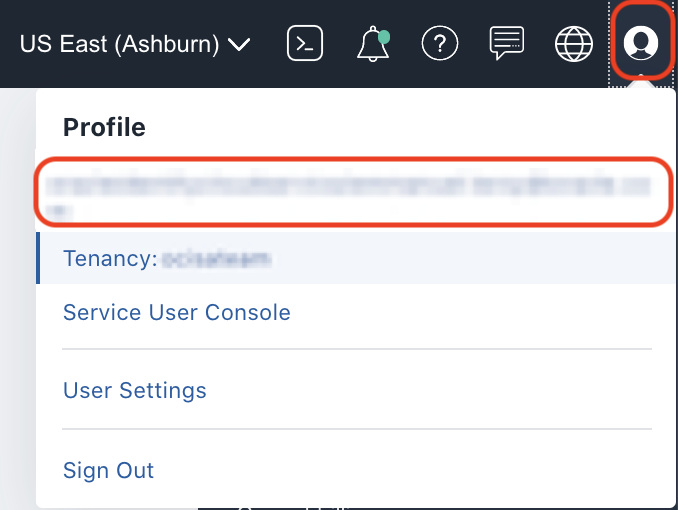

# Deploy Tomcat on Oracle Cloud Infrastructure with the Oracle Autonomous Transaction Processing database

## Introduction

In this tutorial, we will deploy a Tomcat Cluster on Oracle Cloud Infrastructure (OCI) with Terraform, along with an Oracle Autonomous Transaction Processing database.

Estimated Completion Time: 25 minutes.

### Objectives

In this tutorial, you will provision:
* An Apache Tomcat cluster based on Compute VM
* A public load balancer targeting the Tomcat instances
* An Oracle Autonomous Database

### Prerequisites

For this tutorial, you need:

* An Oracle Free Tier, Always Free, Paid or LiveLabs Cloud Account
* Git installed
* Terraform installed (If you need guidance to set up Terraform, please visit the [prerequistes](https://github.com/oracle-quickstart/oci-prerequisites) document)

## Task 1: Gather Required Information

1. Get your `tenancy OCID`:

    1. In the Oracle Cloud Console, **click** your **User** icon (top right corner), then **Tenancy**.

        

    2. **Copy** the OCID of the tenancy and paste it in your environment file.

        

2. Get your `compartment OCID`:

    1. From the navigation menu, select **Identity** and then select **Compartments**.

        

    2. Navigate to the compartment where you want to deploy the infrastructure.

    3. Copy the OCID of the compartment.

        

3. Get your `user OCID`:

    1. In the Oracle Cloud Console, click your **User** icon (top right corner), then click your user name.

        

   2. Copy the OCID of your user and paste it in your environment file.

        

4. Get the OCI public key `fingerprint`. In your user settings, under API Keys, you will find the `fingerprint` value.

    > **Note:** Make sure this is the one matching the OCI public key you created for Terraform.

    
               
## Task 2: Get the Terraform Code

For this step, you may want to open up a separate shell terminal.

1. You'll find the code on Github.com at [https://github.com/oracle-quickstart/oci-arch-tomcat-autonomous](https://github.com/oracle-quickstart/oci-arch-tomcat-autonomous).

2. Click **Code** and download as a zip file or using git command line, in a local folder of your choice, clone the repository with:

    ```bash
    <copy>
    git clone https://github.com/oracle-quickstart/oci-arch-tomcat-autonomous.git
    </copy>
    ```

4. Get into the code folder:

    ```bash
    <copy>
    cd oci-arch-tomcat-autonomous
    </copy>
    ```

## Task 3: Create a `terraform.tfvars` Configuration File

To run the deployment, you need to define a few settings in a file named `terraform.tfvars`.

1. Create a file called `terraform.tfvars` and open it with your prefered editor.

2. Enter the following information in the `terraform.tfvars` file:

    ```
    <copy>
    # Authentication
    tenancy_ocid         = "<tenancy_ocid>"
    user_ocid            = "<user_ocid>"
    fingerprint          = "<finger_print>"
    private_key_path     = "<pem_private_key_path>"

    # Region
    region = "<oci_region>"

    # Compartment
    compartment_ocid = "<compartment_ocid>"

    # ATP instance Password
    atp_db_name = "ATPDB"
    atp_name = "TomcatATP"
    atp_password = "<password 12-30 chars including Upper + Number>"

    # Number of Tomcat nodes (optional)
    numberOfNodes = 2

    # Customer SSH Public Key (optional)
    ssh_public_key = "<ssh_public_key>"
    </copy>
    ```

    For the SSH Public key, make sure to provide the SSH key generated in the on-premises environment and copied earlier.


3. Save the `terraform.tfvars` file.

## Task 4: Run the Deployment

1. Initialize the project:

    ```
    <copy>
    terraform init
    </copy>
    ```

2. Check the plan (optional):

    To determine what will happen, run the `plan` operation:

    ```
    <copy>
    terraform plan
    </copy>
    ```

3. Apply the plan:

   ```bash
    <copy>
    terraform apply
    </copy>
    ```

    You will be prompted to enter `yes` to apply the plan.

    ```
    Do you want to perform these actions?
    Terraform will perform the actions described above.
    Only 'yes' will be accepted to approve.

    Enter a value: yes
    ```

    It will take a few minutes to provision the resources.

    You may proceed to the next tutorial while it is provisioning; however, you will not be able to migrate the data to the database until the infrastructure completed provisioning.

4. Note the outputs of the Terraform for future use.    


## Acknowledgements
 - **Author** - Subash Singh, Emmanuel Leroy, October 2020
 - **Last Updated By/Date** - Emmanuel Leroy, October 2020
